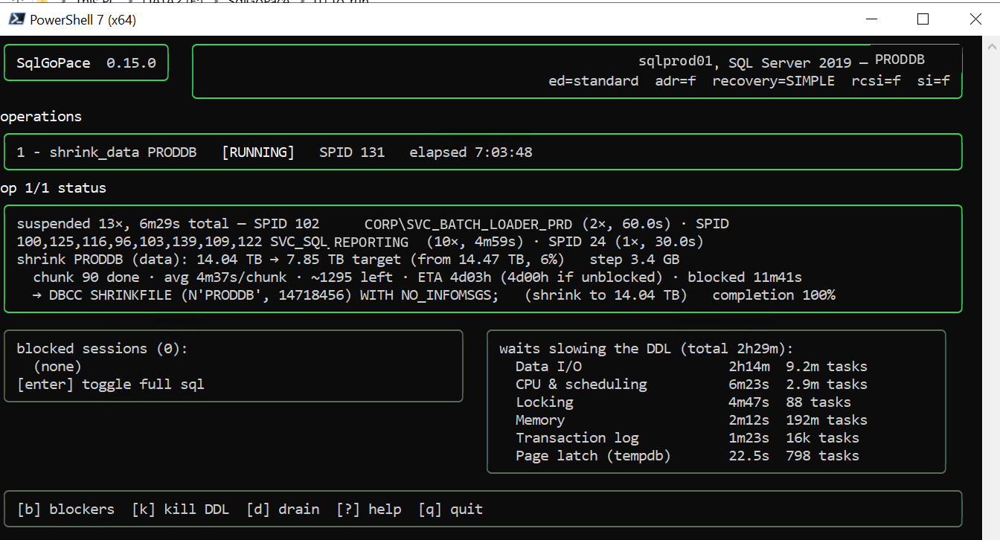

# SqlGoPace

[](https://github.com/rudi-bruchez/SqlGoPace/actions/workflows/ci.yml)
[](https://learn.microsoft.com/en-us/sql/sql-server)
[](https://learn.microsoft.com/en-us/azure/azure-sql/database/sql-database-paas-overview)
[](https://learn.microsoft.com/en-us/azure/azure-sql/managed-instance/sql-managed-instance-paas-overview)
[](https://go.dev)
[](LICENSE)

**Run heavy DDL on a production SQL Server without holding your breath.**

SqlGoPace is a resilient DDL task runner. You declare the operation; it writes the T-SQL,
picks the options your server actually supports, watches locking and transaction-log
pressure while the statement runs, and reacts to trouble with the least destructive
mechanism available.

## In short

- **You declare, it generates.** Sixteen operation types, from `rebuild_index` to
  `batch_delete`. No raw SQL is ever accepted or executed, which is what makes the rest of
  this list possible.
- **The right options for the server in front of you.** `ONLINE`, `RESUMABLE`,
  `WAIT_AT_LOW_PRIORITY`, `MAXDOP` and compression are injected from the detected version
  and edition, so one manifest is correct on 2016 Standard and on 2022 Enterprise.
- **It watches while it works.** A second connection samples locking, blocking and
  transaction-log pressure throughout the operation.
- **It yields before it kills.** `WAIT_AT_LOW_PRIORITY`, then `RESUMABLE` pause and resume,
  then `KILL` as a last resort. No query timeout anywhere, deliberately.
- **You choose who waits and who dies.** Name the sessions allowed to stay blocked, and the
  ones that may be killed for blocking you. Two opposite directions, both off by default.
- **Interruptions are not restarts.** A crash, a Ctrl+C or a closing maintenance window
  leaves the manifest resumable at the operation it stopped on, and a paused resumable index
  build is continued rather than rebuilt.
- **Shrink that reports back.** `TRUNCATEONLY` first, then calibrated chunks that react to
  blocking, and a record of the object it could not get past. Including tempdb.
- **It can plan the work itself.** Point it at a database and it generates the maintenance
  manifests from fragmentation, measured compression gain and forwarded records. You review
  them before anything runs.
- **Every decision is written down.** A `.log` beside each manifest records the statement,
  why each option was chosen or dropped, and every reaction taken.
- **Unattended or watched.** Drain a queue silently from cron, or open an incident console
  and act on blockers by keystroke.

## What it looks like while it works



A real run, seven hours in: a 14.04 TB data file heading for 7.85 TB, ninety chunks done,
averaging four and a half minutes each. Two numbers on that screen are the reason the tool
exists. The ETA gives four days, and four days *if unblocked*, because the run has spent
11m41s of its life waiting on other sessions and it counts that separately. And the waits
panel attributes the rest: two and a quarter hours of data I/O, four minutes of locking,
under a minute and a half of transaction log. Nothing here is inferred from a timer.

## The idea, in one file

You write this:

```yaml
# 01.to_run/010_rebuild.yaml
operations:
  - operation: rebuild_index
    schema: dbo
    table: Orders
    index: IX_Orders_Date
    data_compression: PAGE
```

It runs this, on SQL Server 2022 Enterprise:

```sql
-- wrapped here for reading; the tool emits it on one line
ALTER INDEX [IX_Orders_Date] ON [dbo].[Orders] REBUILD
  WITH (ONLINE = ON (WAIT_AT_LOW_PRIORITY (MAX_DURATION = 1 MINUTES, ABORT_AFTER_WAIT = SELF)),
        RESUMABLE = ON, DATA_COMPRESSION = PAGE);
```

and this, unchanged, on SQL Server 2016 Standard:

```sql
ALTER INDEX [IX_Orders_Date] ON [dbo].[Orders] REBUILD WITH (DATA_COMPRESSION = PAGE);
```

Same manifest. The tool detects the version and edition and injects only what that target
supports. It also knows the restrictions a version table cannot express: `RESUMABLE` is
refused in `tempdb`, and it cannot be combined with `SORT_IN_TEMPDB`. Ask it why with
`--explain` and it tells you, message number included.

## Why it exists

Demanding DDL is risky in production, and the risk is not the statement. It is everything
around it:

- it blocks other sessions, or gets blocked, and one hourly report can keep a rebuild from
  ever finishing;
- it can fill the transaction log;
- a `KILL` triggers a `ROLLBACK` that may cost more than the operation did;
- the correct option set depends on the version *and* the edition in front of you.

So SqlGoPace does not run a script and hope. It monitors on a second connection while the
DDL runs, and when something goes wrong it escalates from gentlest to harshest, stopping at
the first mechanism the server supports: `WAIT_AT_LOW_PRIORITY`, then `RESUMABLE`
pause and resume, then `KILL` as a last resort. There is no query timeout anywhere in the
tool, deliberately: a timer would abort a rebuild three hours in and about to finish.

## Two ways to run it

Left alone, from cron, the Task Scheduler or a SQL Agent job, it drains a queue of manifests
silently and traces every decision to a `.log` beside each one. An overnight window needs no
operator.

```bash
sqlgopace --config config.yaml
```

Or watch it, with the sessions it is blocking, the ones blocking it, and single-key actions
to kill a blocker, ignore it, or pause the operation:

```bash
sqlgopace --config config.yaml --tui
```

Either way, look before you leap. The dry run renders exactly what would execute and takes
no lock:

```bash
sqlgopace --config config.yaml --dry-run --explain 01.to_run/010_rebuild.yaml
```

## Install

```bash
go install github.com/rudi-bruchez/SqlGoPace/cmd/sqlgopace@latest
```

Requires Go 1.26 or later. Running it also needs a `config.yaml`, the compatibility matrix
that ships with the repository, and a login holding `VIEW SERVER STATE` plus the grants for
the operations you use.

[Getting started](docs/getting-started.md) walks the whole path, login included, in about
fifteen minutes.

## Documentation

[**docs/**](docs/README.md) is the map. The pages most people want first:

| | |
|---|---|
| [Getting started](docs/getting-started.md) | Zero to a first monitored rebuild. |
| [Manifest format](docs/manifests.md) and [Operations](docs/operations.md) | What you can ask for, and how to write it. |
| [Running](docs/running.md) | Modes, flags, the queue, and what a re-run repeats. |
| [Blocking, yielding and kills](docs/blocking-and-kills.md) | The part that earns the name. |
| [Permissions](docs/permissions.md) | The grants each operation needs, measured rather than guessed. |
| [Configuration](docs/configuration.md) | Every key, with defaults. |

Writing manifests with an AI assistant is covered by the
[LLM operator guide](docs/llm-operator-guide.md), and the repository ships a
[Claude Code skill](.claude/skills/) that loads the same knowledge automatically.

## Compatibility

SQL Server 2016 and later, in Enterprise, Developer, Standard, Web and Express editions,
plus Azure SQL Database and Azure SQL Managed Instance. Older versions run too, with fewer
options available: the matrix reaches back to SQL Server 2005 and simply injects less.
Continuous integration exercises SQL Server 2022.

## Contributing

Pull requests are welcome. [CONTRIBUTING.md](CONTRIBUTING.md) covers the build and test
commands, how to run the suite against a real server, and the conventions that are not
obvious from the code: manifest-driven rather than raw SQL, no query timeout, and the rule
that a claim about SQL Server behaviour is earned by running it.

For a security problem, see [SECURITY.md](SECURITY.md) rather than opening an issue. It
also describes what privileges the tool holds and where its trust boundary sits, which is
worth reading before pointing it at a production server.

[CHANGELOG.md](CHANGELOG.md) records notable changes.

## License

MIT. See [LICENSE](LICENSE).

`docs/reference/ShrinkDriver.ps1` is not part of SqlGoPace: it is Microsoft's own
`Invoke-ShrinkDriver` sample, kept as the reference this shrink driver was designed against,
under its own MIT licence and with its authorship header intact.
